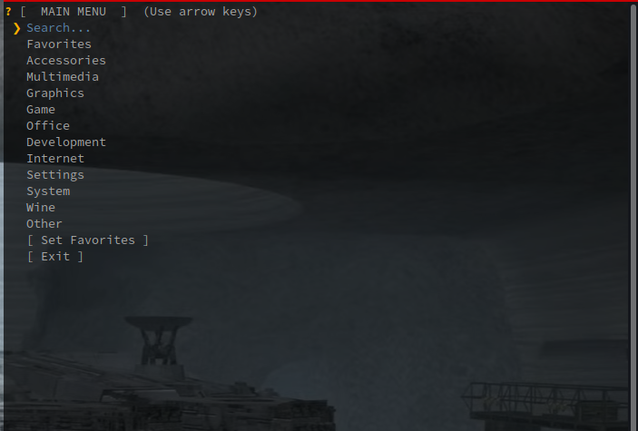
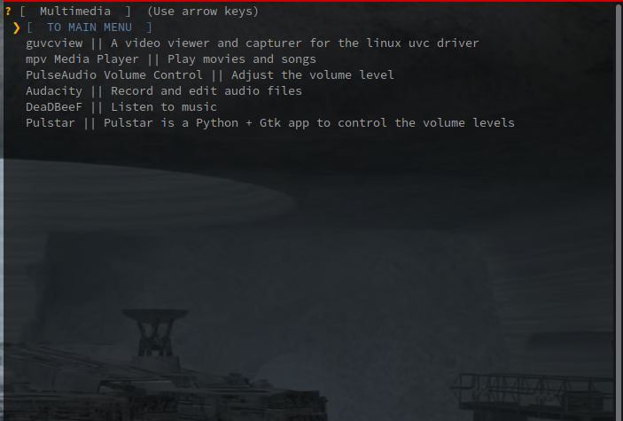

# Shellmen
Shellmen is short for ShellMenu and is intended to be a functional menu for terminals. Rather than needing a full GUI menu for your programs you can view and launch your programs through Shellmen. This is great for systems that don't have panel menus or for systems that have a poorly organized right-click menu.

# Images

