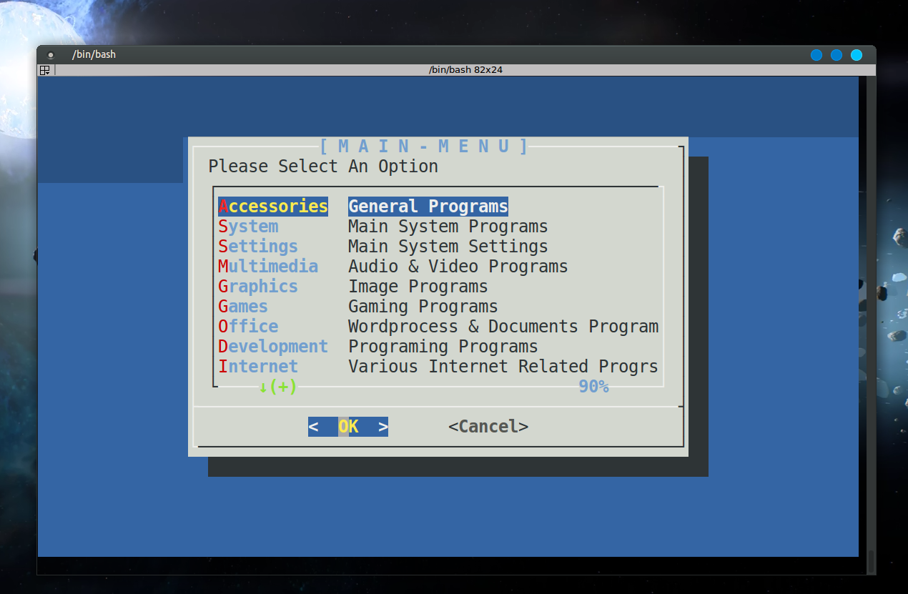
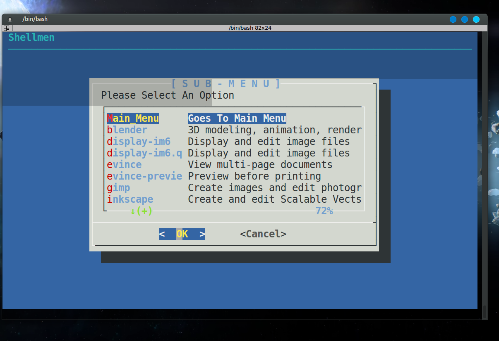

# Shellmen
Shellmen is short for ShellMenu and is intended to be a functional menu for terminals. Rather than needing a full GUI menu for your programs you can view and launch your programs through Shellmen. This is great for systems that don't have panel menus or for systems that have a poorly organized right-click menu.

# NOTE
This is the old and depricated bash version. It never really functioned to uts full potential. Please use the Python 3 version up a directory...

# To Install
To install automatically please run the install.sh file and select option 2.
You will need to make it exacutable.
 
To Install manually:
<pre>
sudo cp shellMen.sh /bin/
sudo chown root:root /bin/shellMen
sudo chmod 744 /bin/shellMen
</pre>
# To Uninstall
To uninstall automatically please run the install.sh file and select option 2.
 
To Uninstall manually:
<pre>
sudo rm /bin/shellMen
</pre>
# License
You should have received a copy of the GNU General Public License along with this program.
 If not, see <http://www.gnu.org/licenses/>.

# Images

